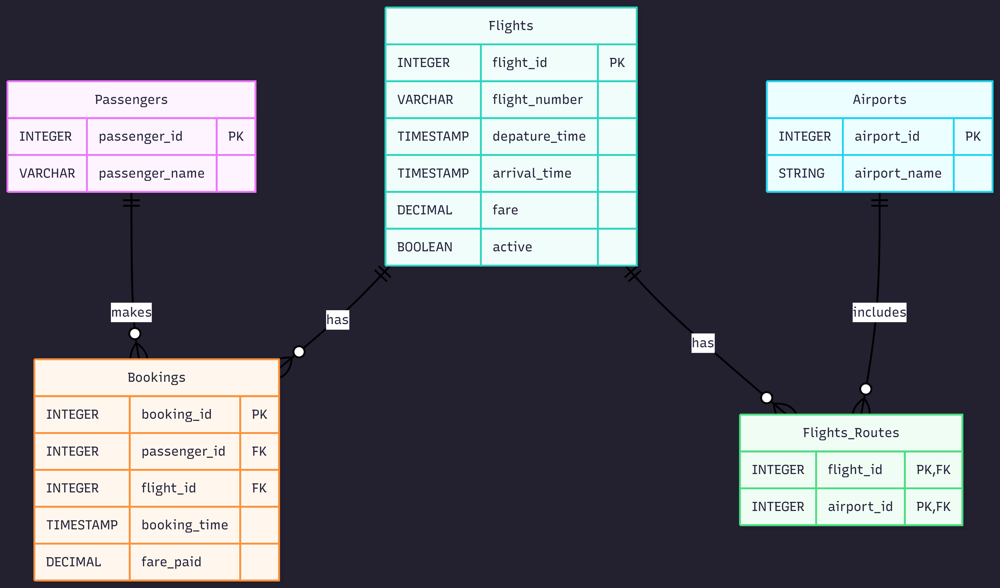

## Project title: Airline_Booking_Database
Relational database course project for an airline booking system.

## Theme
Airline Booking System

## Domain
The Airline Booking System is a platform designed to organize and manage information about passengers, flights, bookings, airports, and flight routes. Passengers can make bookings for available flights, and each booking connects a passenger with a specific flight. The system also keeps information about airports and connects flights to airports through flight routes.

The database should be able to answer important questions about the airline booking process. For example, it should identify which flights a passenger has booked, which passengers are booked on a particular flight, and which airports are associated with a flight. It should also provide flight information such as the flight number, departure time, arrival time, fare, and whether the flight is active. Organizing this information in a relational database helps keep the data accurate, consistent, and easy to retrieve.

## Entity Relationship Diagram 
The following ERD shows the relationships between the main entities in the Airline Booking Database.

